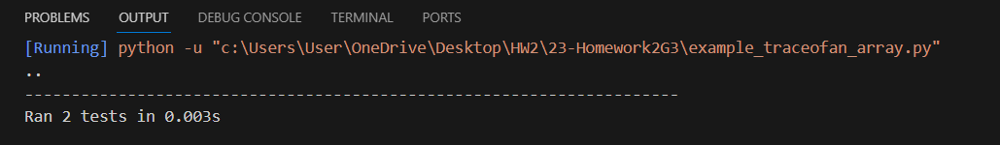

# Calculate Trace of a Square Matrix

In this Python example, we will define a function to calculate the trace of a square matrix using the NumPy library. The trace of a matrix is the sum of its diagonal elements.

## Function: calculate_trace(matrix)

```python
import numpy as np

def calculate_trace(matrix):
    """
    Calculate the trace of a square matrix.

    Parameters:
    matrix (numpy.ndarray): The input square matrix.

    Returns:
    float: The trace of the matrix (sum of diagonal elements).

    Raises:
    ValueError: If the input matrix is not square (number of rows != number of columns).
    """
    if matrix.shape[0] != matrix.shape[1]:
        raise ValueError("Input matrix must be square.")

    trace = np.trace(matrix)
    return trace
```
- The calculate_trace function takes a NumPy array representing a square matrix as input. It first checks if the input matrix is square by comparing the number of rows and columns. If the matrix is not square, it raises a ValueError. Otherwise, it calculates the trace using NumPy's np.trace function and returns the result.

### Unit Tests
We will use the unittest module to write unit tests to verify the correctness of the calculate_trace function.

```python
import unittest

class TestCalculateTrace(unittest.TestCase):

    def test_trace(self):
        # Test with a 3x3 identity matrix
        identity_matrix = np.identity(3)
        self.assertEqual(calculate_trace(identity_matrix), 3.0)

        # Test with a 2x2 matrix with known trace
        matrix = np.array([[1, 2], [3, 4]])
        self.assertEqual(calculate_trace(matrix), 5.0)

    def test_non_square_matrix(self):
        # Test with a non-square matrix
        non_square_matrix = np.array([[1, 2, 3], [4, 5, 6]])
        with self.assertRaises(ValueError):
            calculate_trace(non_square_matrix)

if __name__ == "__main__":
    unittest.main()
```

The TestCalculateTrace class contains two test methods:

- test_trace: This method tests the trace calculation with a 3x3 identity matrix and a 2x2 matrix with a known trace value. It uses self.assertEqual to check if the calculated trace matches the expected values.

- test_non_square_matrix: This method tests the function's behavior when given a non-square matrix. It uses self.assertRaises to check if a ValueError is raised as expected.

To run the unit tests, you can execute the script, and it will ensure that the calculate_trace function works correctly.


#### Output: 
For the above unit tests, we got the following outputs:
- For 3*3 identity matrix,
  Tr (I) = 3

- For 2*2, [[1, 2], [3, 4]] matrix,
  Tr = 5

- For the matrix which is not square, we got the value error.

#### The implementation time for this unit test is :


           


