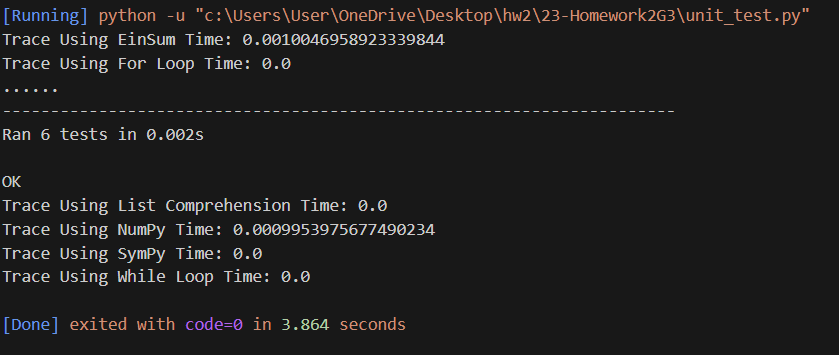
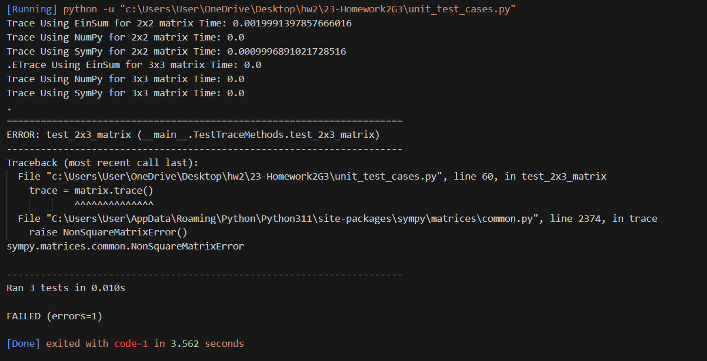

### Case Unit Tests Results for Various methods:

- For time trace of 3 * 3 matrix, the code from the algorithm executed with the following result:

- For time trace of 2 * 2, 3 * 3 and 2 * 3 matrices:

- For time trace of 10 * 10, 100 * 100, and 500 * 500 matrices:

